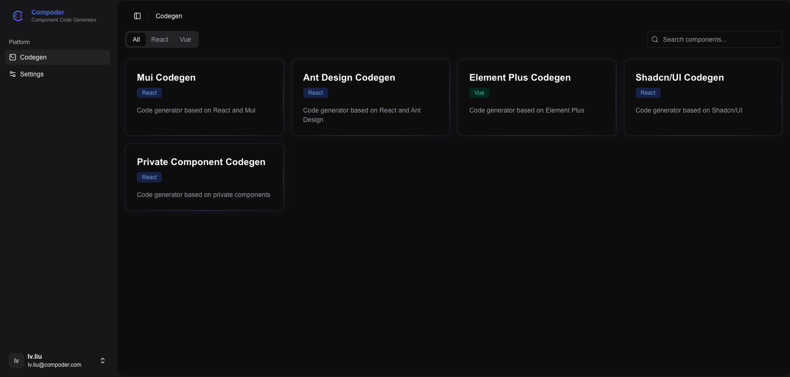
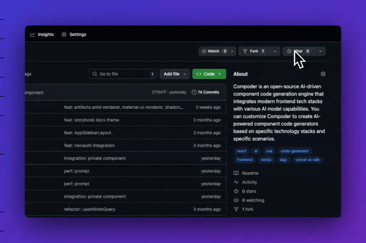

<div align="center">

<h1 align="center" style="border-bottom: none">
    <b>
        <a href="https://github.com/IamLiuLv/compoder">Compoder</a><br>
    </b>
    AI-Powered Component Code Generator For Every Frontend Engineer<br>
</h1>

Compoder is an open-source AI-powered component code generation engine that integrates modern frontend tech stacks with various AI model capabilities. You can customize Compoder to create AI-powered component code generators based on specific technology stacks (such as React, Vue, Mui, Antd, Element-Plus, Tailwind CSS, Shadcn UI...) and specific scenarios (such as Landing Pages, Email Templates, Admin Dashboard Forms).

<p align="center">
    <a href="https://github.com/IamLiuLv/compoder" target="_blank">
        </a>
    <a href="https://github.com/IamLiuLv/compoder/discussions" target="_blank">
        </a>
    <a href="#community-and-support" target="_blank">
        </a>
    <a href="https://github.com/IamLiuLv/compoder/issues" target="_blank">
        </a>
</p>

<p align="center">
  <a href="./README.md"></a>
  <a href="./README_CN.md"></a>
</p>

</div>

[Compoder Demo Video - Click to Watch](https://ai.iamlv.cn/compoder~.mp4)

## 🔥 Core Features:

**Customizable Codegen (Component Code Generator)**: Freely customize component code generators based on various tech stacks, component libraries, scenarios, code specifications, and AI models.



**1. Tech Stack Customization**

Customize Codegens based on specific technology frameworks (such as React, Vue, HTML...)

**2. Component Library Customization**

Customize Codegens based on any open-source & private component libraries (such as Mui, Antd, Element-Plus, Shadcn UI, company private component libraries...)

**3. Scenario Customization**

Customize Codegens for specific scenarios (such as Landing Pages, Email Templates, Admin Management Systems, APP Prototypes, Data Cards, Promotional Posters...)

**4. Code Specification Customization**

Customize Codegens based on specific code specifications (such as code file structure, styling approaches...)

**5. AI Model Customization**

Customize Codegens based on various AI models (such as OpenAI, Claude...)

## 🌟 Basic Functions

- Prompt (Text, Image) To Code: Input text or images to generate component code

- Code Version Iteration: Support code version iteration, view historical versions, and generate new code based on any version

- Online Code Fine-tuning: Support online code fine-tuning with an integrated code editor for intuitive code adjustment and saving

- Real-time Code Preview: Built-in real-time preview sandbox environment supporting various tech stacks (such as React, Vue, open-source packages, private packages) with second-level rendering

## 🛣️ Roadmap

We are continuously improving Compoder and will launch more exciting new features in the future:

- Underlying support for Code To Figma: Convert code generated in Compoder to Figma designs with one click

- Underlying support for Figma To Code: Generate component code from Figma designs with one click, supporting conversion to components in different tech stacks

- Open Codegen Template Marketplace: Allow users to freely share, download, use, modify, and submit Codegen templates

- More scenario-specific Codegen templates: Such as Landing Pages, Email Templates, Admin Management Systems, APP Prototypes, Data Cards, Promotional Posters...

- ✅ More rich Codegen templates: Support more component libraries and templates, such as Mui, Antd, Element-Plus, Shadcn UI, company private component libraries...

- ✅ More efficient development workflow: Support more efficient development workflows, such as code version iteration, online code fine-tuning, real-time code preview sandbox...

- ✅ Underlying implementation supporting customization based on various tech stacks, component libraries, scenarios, code specifications, AI models for component code generators

- ✅ Prompt to code: Support component code generation from text & image interactions

## Quick Start

### Local Development

**1. Environment Setup**

- [Node.js](https://nodejs.org/) v18.x or higher
- [pnpm](https://pnpm.io/) v9.x or higher
- [Docker](https://www.docker.com/products/docker-desktop/)
- [Docker Compose](https://docs.docker.com/compose/install/)

**2. Clone Repository and Initialize Dependencies**

```bash
# Clone the repository
git clone https://github.com/IamLiuLv/compoder.git
cd compoder

# Install dependencies
pnpm install
```

**3. Start Docker Container**

```bash
# Docker configuration
cp docker-compose.template.yml docker-compose.yml

# For local development, mainly used to start MongoDB database
docker compose up -d

# or
docker-compose up -d
```

**4. Environment Variables & Configuration Files**

```bash
# Fill in the corresponding environment variables
cp .env.template .env

# Model provider configuration (need to replace BaseUrl, API Key)
cp data/config.template.json data/config.json

# Codegen configuration initialization
cp data/codegens.template.json data/codegens.json
pnpm migrate-codegen
```

**5. Start Storybook Business Component Documentation**

```bash
pnpm storybook
```

**6. Start Compoder**

```bash
pnpm dev
```

**7. Start Code Rendering Sandbox (Artifacts)**

```bash
# Start Antd rendering sandbox
cd artifacts/antd-renderer
pnpm dev

# Start Shadcn UI rendering sandbox
cd artifacts/shadcn-ui-renderer
pnpm dev

# Start Mui rendering sandbox
cd artifacts/mui-renderer
pnpm dev

# Start Element Plus rendering sandbox
cd artifacts/element-plus-renderer
pnpm dev
```

More detailed usage documentation, please refer to [CONTRIBUTING.md](./CONTRIBUTING.md).

### Deployment with Docker

Deploy your own feature-rich Compoder instance using Docker. Our team is working on providing Docker images.

## Tech Stack

Compoder is built on the following open-source projects:

- [Next.js](https://github.com/vercel/next.js) - React framework
- [Shadcn UI](https://ui.shadcn.com/) - Component library
- [Tailwind CSS](https://github.com/tailwindlabs/tailwindcss) - Utility-first CSS framework
- [Storybook](https://github.com/storybookjs/storybook) - UI component development environment
- [MongoDB](https://github.com/mongodb/mongo) - Document database
- [Mongoose](https://github.com/Automattic/mongoose) - MongoDB object modeling
- [NextAuth.js](https://github.com/nextauthjs/next-auth) - Authentication solution
- [Zod](https://github.com/colinhacks/zod) - TypeScript-first schema validation
- [Tanstack Query](https://github.com/tanstack/query) - Frontend request handling library
- [Vercel AI SDK](https://github.com/vercel/ai) - AI model integration

We deeply appreciate these powerful yet simple libraries provided by the community, which allow us to focus more on implementing product logic. We hope our project can also provide an easier-to-use AI component code generation engine for everyone.

## Stay Ahead

Star Compoder on GitHub to receive notifications about new versions immediately.



## Community and Support

- [GitHub Discussions](https://github.com/IamLiuLv/compoder/discussions) 👉: Best for sharing feedback and asking questions.
- [GitHub Issues](https://github.com/IamLiuLv/compoder/issues) 👉: Best for reporting bugs and suggesting features.
- [WeChat](./assets/wechat.png): Scan the QR code below, add as a WeChat friend with the note: Compoder, to join the Compoder community. We will share the latest updates, technical insights, component code generator templates, and look for long-term partners.


## Contributing

For contributors who want to contribute to Compoder, we welcome your PRs and Issues. We will review and provide feedback promptly.

> Currently, Compoder is in an early rapid iteration stage, and we welcome interested developers to join. We will maintain a long-term cooperative relationship.

**Contributors**

Thanks to all the contributors who have contributed to Compoder. Your efforts make Compoder better.

<a href="https://github.com/IamLiuLv/compoder/graphs/contributors">
  
</a>

## Security Issues

To protect your privacy, please avoid posting security-related issues on GitHub. Please send your questions to lv.xbb.xmn@gmail.com, and we will provide you with a more detailed response.

## License

This repository follows the [Compoder Open Source License](./LICENSE), which is essentially Apache 2.0 with some additional restrictions.
