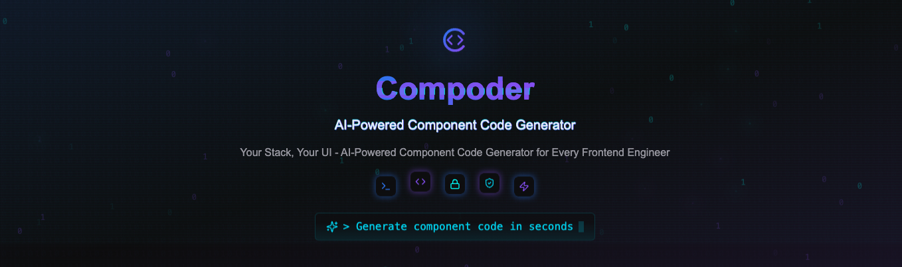

<div align="center">

<h1 align="center" style="border-bottom: none">
    <b>
        <a href="https://github.com/IamLiuLv/compoder">Compoder</a><br>
    </b>
    AI-Powered Component Code Generator For Every Frontend Engineer<br>
</h1>

Compoder 是一个开源的 AI 驱动组件代码生成引擎，集成了现代前端技术栈和多种 AI 模型能力，你可以基于 Compoder 定制基于特定技术栈（如：React、Vue、Mui、Antd、Element-Plus、Tailwind CSS、Shadcn UI...），以及特定场景（如：Landing Page、邮件模版、后台表单组件）的 AI 驱动的组件代码生成器。

<p align="center">
    <a href="https://github.com/IamLiuLv/compoder" target="_blank">
        </a>
    <a href="https://github.com/IamLiuLv/compoder/discussions" target="_blank">
        </a>
    <a href="#社区与支持" target="_blank">
        </a>
    <a href="https://github.com/IamLiuLv/compoder/issues" target="_blank">
        </a>
</p>

<p align="center">
  <a href="./README.md"></a>
  <a href="./README_CN.md"></a>
</p>

</div>

[Compoder 演示视频 - 点击观看](https://ai.iamlv.cn/compoder~.mp4)

## 🔥 核心特性：

**定制 Codegen（Component Code Generator）**：支持自由定制基于多种技术栈、组件库、场景、代码规范、AI 模型等的组件代码生成器。


**1. 技术栈定制**

定制基于特定技术栈框架（如：React、Vue、HTML ...）的 Codegen

**2. 组件库定制**

定制基于任意开源 & 私有基础组件库（如：Mui、Antd、Element-Plus、Shadcn UI、公司私有组件库...）的 Codegen

**3. 场景定制**

定制基于特定场景（如：Landing Page、邮件模版、后台管理系统、APP 原型、数据卡片、海报宣传...）的 Codegen

**4. 代码规范定制**

定制基于特定代码规范（如：代码文件结构、样式风格...）的 Codegen

**5. AI 模型定制**

定制基于多种 AI 模型（如：OpenAI、Claude...）的 Codegen

## 🌟 基础功能

- Prompt（文字、图片）To Code：输入文字或图片，即可生成组件代码

- 代码版本迭代：支持代码版本迭代，可以查看历史版本，并基于任意版本生成新的代码

- 代码在线微调：支持代码在线微调，集成了代码编辑器，可以直观对代码进行微调和保存

- 代码实时预览：自建了一套代码实时预览沙箱环境，支持多种技术栈（如：React、Vue、开源包、私有包）的秒级渲染

## 🛣️ 路线图

我们正在持续改进 Compoder，未来将推出更多令人兴奋的新功能：

- 底层能力支持 Code To Figma：支持 Compoder 中生成的代码一键转换为 Figma 设计稿

- 底层能力支持 Figma To Code：支持从 Figma 设计稿一键生成组件代码，支持转换为不同技术栈的组件代码

- 开放 Codegen 模板市场：支持用户自由分享、下载、使用、修改、提交 Codegen 模板

- 更多面向不同场景的 Codegen 模板：如：Landing Page、邮件模版、后台管理系统、APP 原型、数据卡片、海报宣传...

- ✅ 更丰富的 Codegen 模板：支持更多组件库和模板，如：Mui、Antd、Element-Plus、Shadcn UI、公司私有组件库...

- ✅ 更高效的开发工作流：支持更高效的开发工作流，如：代码版本迭代、代码在线微调、代码实时预览沙箱...

- ✅ 底层实现支持定制基于多种技术栈、组件库、场景、代码规范、AI 模型等的组件代码生成器

- ✅ prompt to code：支持从文字 & 图片交互生成组件代码

## 快速开始

### 本地开发

**1. 环境准备**

- [Node.js](https://nodejs.org/) v18.x 或更高版本
- [pnpm](https://pnpm.io/) v9.x 或更高版本
- [Docker](https://www.docker.com/products/docker-desktop/)
- [Docker Compose](https://docs.docker.com/compose/install/)

**2. 克隆仓库初始化依赖包**

```bash
# 克隆仓库
git clone https://github.com/IamLiuLv/compoder.git
cd compoder

# 安装依赖
pnpm install
```

**3. 启动 Docker 容器**

```bash
# docker 配置
cp docker-compose.template.yml docker-compose.yml

# 本地开发下，主要用来启动 MongoDB 数据库
docker compose up -d

# or
docker-compose up -d
```

**4. 环境变量 & 配置文件**

```bash
# 填写对应的环境变量
cp .env.template .env

# Model provider 配置（需要更换其中的 BaseUrl、API Key）
cp data/config.template.json data/config.json

# Codegen 配置初始化
cp data/codegens.template.json data/codegens.json
pnpm migrate-codegen
```

**5. 启动 Storybook 业务组件文档**

```bash
pnpm storybook
```

**6. 启动 Compoder**

```bash
pnpm dev
```

**7. 启动代码渲染沙箱（Artifacts）**

```bash
# 启动 Antd 渲染沙箱
cd artifacts/antd-renderer
pnpm dev

# 启动 Shadcn UI 渲染沙箱
cd artifacts/shadcn-ui-renderer
pnpm dev

# 启动Mui 渲染沙箱
cd artifacts/mui-renderer
pnpm dev

# 启动Element Plus 渲染沙箱
cd artifacts/element-plus-renderer
pnpm dev
```

更多关于 Compoder 的详细使用文档，请参考 [CONTRIBUTING_CN.md](./CONTRIBUTING_CN.md)。

### 使用 Docker 部署

> 使用 Docker 部署您自己的功能丰富的 Compoder 实例。我们的团队正在努力提供 Docker 镜像。

## 技术栈

Compoder 基于以下开源项目构建：

- [Next.js](https://github.com/vercel/next.js) - React 框架
- [Shadcn UI](https://ui.shadcn.com/) - 组件库
- [Tailwind CSS](https://github.com/tailwindlabs/tailwindcss) - 实用优先的 CSS 框架
- [Storybook](https://github.com/storybookjs/storybook) - UI 组件开发环境
- [MongoDB](https://github.com/mongodb/mongo) - 文档数据库
- [Mongoose](https://github.com/Automattic/mongoose) - MongoDB 对象模型
- [NextAuth.js](https://github.com/nextauthjs/next-auth) - 身份验证解决方案
- [Zod](https://github.com/colinhacks/zod) - TypeScript 优先的模式验证
- [Tanstack Query](https://github.com/tanstack/query) - 前端请求处理库
- [Vercel AI SDK](https://github.com/vercel/ai) - AI 模型集成

我们对社区提供的这些强大而简单的库表示深深的感谢，它们使我们能够更专注于实现产品逻辑。我们希望我们的项目也能为每个人提供更易用的 AI 组件代码生成引擎。

## 保持领先

在 GitHub 上给 Compoder Star，并立即收到新版本的通知。


## 社区与支持

- [GitHub 讨论](https://github.com/IamLiuLv/compoder/discussions) 👉：最适合分享反馈和提问。
- [GitHub Issues](https://github.com/IamLiuLv/compoder/issues) 👉：最适合报告 bugs 和提出功能建议。
- [微信](./assets/wechat.png)：扫描下方二维码，添加微信好友，备注：Compoder，拉你进入 Compoder 社区，我们会在社区中分享 Compoder 的最新动态、技术分享、组件代码生成器模板，以及寻找长期合作伙伴。


## Contributing

对于想为 Compoder 做出贡献的贡献者们，我们欢迎您提交 PR 和 Issue，我们将在第一时间进行审核和反馈。

> 目前 Compoder 处于早期迅速迭代阶段，欢迎感兴趣的开发者加入，我们会长期保持合作关系。

**Contributors**

感谢所有为 Compoder 做出贡献的贡献者们，是你们的努力让 Compoder 变得更好。

<a href="https://github.com/IamLiuLv/compoder/graphs/contributors">
  
</a>

## 安全问题

为保护您的隐私，请避免在 GitHub 上发布与安全相关的问题。请将您的问题发送至 lv.xbb.xmn@gmail.com，我们将为您提供更详细的回复。

## 许可证

本仓库遵循 [Compoder Open Source License](./LICENSE) 开源协议，该许可证本质上是 Apache 2.0，但有一些额外的限制。
